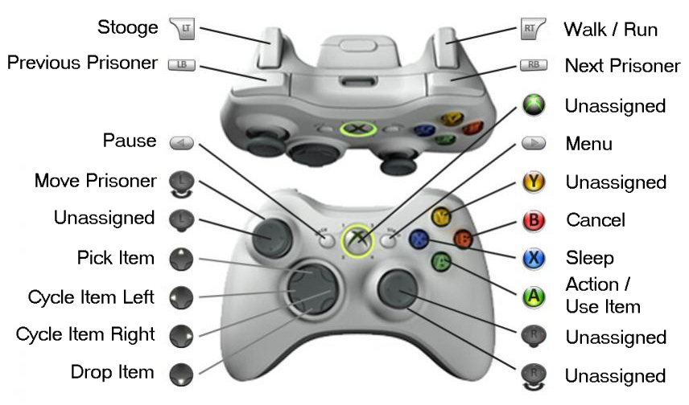

Frequently Asked Questions
==========================

Installation
------------

* (Windows) Extract all the files and then launch `COLDITZ.EXE`
* (PSP) Extract the files into `PSP/GAME/` (so that you end up with a `PSP/GAME/Colditz Escape` 
  directory on your memory stick. You should now be able to launch "Colditz Escape" in your Games menu.

Default Controls
----------------

### Windows Keyboard

* (Numpad) <kbd>8</kbd> : Move Prisoner Up
* (Numpad) <kbd>4</kbd> : Move Prisoner Left
* (Numpad) <kbd>6</kbd> : Move Prisoner Right
* (Numpad) <kbd>2</kbd> : Move Prisoner Down
* (Numpad) <kbd>5</kbd> : Use Currently Selected Item or Enter/Exit Tunnel (if open)

* <kbd>↑</kbd> : Pickup Item
* <kbd>↓</kbd> : Drop Item
* <kbd>←</kbd>/<kbd>→</kbd> : Cycle Through Inventory

* <kbd>Space</kbd> : Toggle Walk/Run
* <kbd>Esc</kbd> : Game Menu

* <kbd>F1</kbd> : Select British Prisoner
* <kbd>F2</kbd> : Select French Prisoner
* <kbd>F3</kbd> : Select American Prisoner
* <kbd>F4</kbd> : Select Polish Prisoner
* <kbd>F5</kbd> : Pause Game / View All Prisoners
* <kbd>F9</kbd> : Sleep
* <kbd>F10</kbd> : Set Stooge 

### Windows XBox 360 Controller

### PSP

* Analog Stick : Move Prisoner

* <kbd>✖</kbd> : Use Currently Selected Item or Enter/Exit Tunnel (if open)
* <kbd>○</kbd> : Toggle Walk/Run
* <kbd>◻</kbd> : Sleep
* <kbd>△</kbd> : Set Stooge

* <kbd>↑</kbd> : Pickup Item
* <kbd>↓</kbd> : Drop Item
* <kbd>←</kbd>/<kbd>→</kbd> : Cycle Through Prisoners
* <kbd>LT</kbd>/<kbd>RT</kbd>; : Cycle  Through Inventory

* <kbd>Select</kbd> : Pause Game / View All Prisoners
* <kbd>Start</kbd> : Game Menu

Note that the controls above can be modified by editing your `config.xml` in the game directory.

Gameplay
--------

### How can I use tunnels?
### How do I use the candle?
### How do I use the saw?
### How do I use the pick-axe?
### How do I use the shovel?

To use a tunnel, you must first use the right tool to open the tunnel exit. For tunnel exits located
on wood floors, use the saw, for exits on pavement, use the pick-axe, and for exits on grass, use the
shovel. The tool will be consumed in the process
To enter an open tunnel, you must use a candle (which is consumed as well).
To open a tunnel exit, from within a tunnel, you need to use the shovel, regardless of the type of
ground that exit sits on. If the exit is already open, just pressing action will do.

### What is required for a successful escape?
### How do I use the papers?

To successfully escape from the castle, you will need to be in possession of German papers (those are
different from passes, which are only used with guards). If you don't have these papers, you will be
returned to the Castle

### How do I use stooge?

You can set stooge with prisoners, as means of alert for guards. Once a stooge is set (STOOGE should
appear in the status bar), the focus will go back to the prisoner who set the stooge if a guard comes
close by.

This can be used to warn a prisoner visiting a restricted area that a guard is on his way. To set a
stooge, make sure your prisoner is idle and press the "Stooge" key.

### How can I open doors?
### How do I use Keys/Lock-picks?

Locked doors need to be opened with the relevant tool:
* "Low Security doors" require the use of a a lock-pick
* "Grade One Security doors" require a security key one
* "Grade Two Security doors" require a security key two
Any key used is immediately consumed

### How do I use stones?

Stones are used to slow down guards that have entered a running pursuit. If guards are running after
you, using a stone will make them revert to a walking pursuit, thus giving you a chance to escape.

To use a stone, make sure it is selected in your inventory and press the action key

### What is the fatigue bar used for?
### How do I use sleep?

Walking, running and especially crawling increase your fatigue. The fatigue level is also increased
with every game hour that pass.
Once the fatigue bar reaches its max level, you will no longer be able to run.

To reduce fatigue, you must return to your quarters to sleep. Once in your starting room, press the
"Sleep" key to go to bed. Note that you can only sleep in your own bed.

### How do I use uniforms?

If you find a guard's uniform, you can change into it to try to fool the guards. To use a uniform,
simply select it in your inventory and press the action key.
Note however that guards are suspiscious by nature and will ask for a pass if they don't recognize
your face.

### How do I use a pass?

The pass is used, when you are wearing a German uniform, and are intercepted by a guard. Unless
you can provide a pass then, you will be sent to prison. A pass is immediately consumed.

In the enhanced version of the game, guards do remember when they have seen a pass, and will not
ask you again. A guard that has previously seen your pass will be identified with a small pass icon.

### How do I use the rifle?

Just like in the original game, the rifle is not used for anything in this game. Our reverse
engineering of the original game uncovered no use for the rifle whatsoever. One can only speculate
what the developers had meant the rifle to be used for when they designed the game.

### Are there other any items available in the game?

If you cheated, are really lucky, or somehow found a bug, you might also find a stethoscope or a
prisoner's uniform in the game.

The prisoner's uniform allows you to change back into prisoner's clothes (duh), which is pretty
much useless.
The stethoscope was not used in the original game.

### Are there any cheat modes?

Well, who knows...

### What does "Enhancements" do in the options menu?

The Enhancement menu adds a set of feature that I felt were missing from the original game:

The first enhancement, which is also called `opt_enhanced_guards` in `config.xml`, make the
guards in the immediate vicinity remember when they've seen a pass from a prisoner in uniform,
and thus continue to get fooled by that prisoner if they see him again. It will also make their
behaviour a bit more human after they caught with a prisoner.

The second enhancement (`opt_enhanced_tunnels` in config.xml) restricts the field of vision
when moving in a tunnel, which makes tunnel handling a bit more challenging.

Enhancements can only be turned on if "Original Mode" is not active.

Game issues
-----------

### Why are there picture/black corners onscreen?

This version of the game was ported primarily for the PSP (which is also why the base resolution
of the game is 480x272), so we tried to use as much screen real estate as possible. However, the
original game was not designed for widescreen, and as such, some "tiles" would be missing around
the screen corners, when moving on the exterior map. As this would have had a detrimental effect
on the aesthetics of the game, we chose to hide them using "picture corners".

### I can't save the game! / Save and Load are disabled

This is because you enabled the original game mode in the options. The original game did not
have a save/load feature, and therefore those features, along with any other enhancements, are
disabled when "original mode" is on. To disable "original mode", and re-enable game saves, go to
the options menu. Of course, when you do that, you'll probably also find out if you're a chicken...

### I get an "Integrity check failure" when starting the game

This means that the data files you are using differ in content from the ones expected by the game,
which can happen if:
* Your files are corrupted &rarr; download the binaries again
* You manually changed the data files &rarr; if you want to mod the game, you should start by
  recompiling the source and remove the MD5 checks.
  
### (PSP) Whoa, I never realized the remanence on the PSP was so bad! / The game smears a lot & doesn't look too good on older PSPs

Indeed. Please address your complaints to _"Hey Sony, it sure took you a while to put a decent
screen on the PSP, 1-7-1 Konan, Minato-ku, Tokyo 108-0075, Japan"_.

More seriously though, the original game was developed for screens (CRT) that, unlike LCD, were
a lot more responsive and allowed greater freedom in the choice of palette & contrast. Not much
can be done here, apart changing all the palettes. Gotta give props to the actual PSP game artists,
who have had to put up with the kind of creativity restriction introduced by Sony when they tried
to make a quick buck by using such a poor response time LCD on the PSPs 1000 & 2000...

### (Windows) The Intro video does not play

Make sure your video codecs are up to date. You might want to download and install the K-lite codec pack.

### (Windows) I get a "winXAudio2Init: failed to init XAudio2 engine" / "Could not initialize audio" error message

The Windows version uses the latest DirectX audio engine. Please make sure you have the latest
DirectX runtime installed (which can be downloaded from here).

### (Windows) The game doesn't run / runs too slow on my Windows platform!

* If you're using an embedded GPU (eg. Intel motherboard GPU), chances are the graphics extensions
  required to play the game (like 16 bit little endian GRAB textures) will not be present, and you
  will get a white screen
* Check that your monitor refresh rate is at least 50Hz. If you run the game with a 24Hz refresh
  rate for instance (eg, on an HTPC), the game speed will be bound by that frequency, no matter
  how fast your CPU/GPU are.
* If you are using graphics smoothing on Windows (with a GPU cards that supports OpenGL 2.0), the
  GPU shader filter might increase your CPU usage &rarr; disable GFX smoothing.
* Try to update to the latest DirectX. Tests showed that there can be a drastic improvement in
  speed between using DirectX 9 and DirectX 10

Our tests showed that the the game should be playable at full speed on a P4 2.0 GHz Windows XP
platform, with a decent nVidia or ATI graphics card and DirectX 10.

Note that you can use the <kbd>#</kbd> key on windows to display the game's current FPS.

Data files
----------

### Why didn't you provide the data files in the first release?

For potential legal reasons. However, since potential copyright holders have not manifested
themselves, I will now consider the original game and data as Abandonware and provide the required
data files along with the binaries.

### Where can I obtain alternate data files?

I am not aware of any alternate data files for the game. However, if you want to replace the
files provided with the current binaries, a search for ADF (Amiga Disk File) images of Escape From
Colditz in any search engine should direct you to original disk dumps.

You can then extract the data files listed on the home page from the ADF image. You can use the
Windows version of the `unadf` executables (preferably `staticunadf.exe`) from the `binw32.zip` 
archive at http://lclevy.free.fr/adflib/adflib.html

### To extract the files:

* Extract the files from `binw32.zip` to a temporary directory
* Extract the `.adf` file from, the compressed ADF image you downloaded to another temporary directory.
* Create a new directory (this is required because unadf does not create a subdirectory when
  extracting the files). Or you can use the directory where you extracted "Colditz Escape"
* Copy the `staticunadf.exe` executable as well as the `.adf` file (e.g. 
  `Escape from Colditz (1990)(Digital Magic)(M4)[cr SKR][FIXED GALAHAD].adf`) to the directory above.
* From a command prompt, navigate to the directory where you have theses 2 files and run the command:  
  `staticunadf yourfile.adf` (e.g. `staticunadf Escape from Colditz (1990)(Digital Magic)(M4)[cr SKR][FIXED GALAHAD].adf`)

### I can't seem to have `COLDITZ-LOADER` in the files I extracted! How can I make the game work?

Most of the ADF versions found on the internet don't come with `COLDITZ-LOADER`, but instead with `SKR_COLD`,
which is the compressed version of `COLDITZ-LOADER`.

The game engine is smart enough to detect this, and automatically uncompress and create `COLDITZ-LOADER`
if `SKR_COLD` is found.

Thus you only need to provide either `SKR_COLD` (compressed version) or `COLDITZ_LOADER` (uncompressed
version) to run the game initially.

Future Enhancements
-------------------

### Do you plan to release new/custom game maps?

Not at this stage. This would require a map editor, which I haven't any plans for. However, with the
source code being available, if you really want, you could probably create a map editor yourself.

### Do you plan to port the game to Linux/MacOS/some other OS?

Not personallty, but maybe somebody else will...

For the record, the main reason this port was done was because it was challenging to:
* Reverse Engineer the Amiga version to get a complete understanding of the game
* Create a port that would be compatible with 2 very different architectures, i.e. the PSP (gcc based
  through the PSP SDK) and Windows (Visual Studio)

After completing the above, porting Colditz Escape! to Linux or MacOS does not really represent a
challenge, so I'm not planning to push it further.

You do have complete access to the source however, so if you want to port it to any other platform,
you're more than welcome (as long as your port satisfies the GPL v3 conditions).

Other Questions
---------------

### Where can I download the latest version / find updated information?

For the latest releases of Colditz Escape as well as up to date information, you should visit  
  http://tiny.cc/colditz-escape

### Where can I download/browse the source code?

Colditz Escape! is released under the GPL v3.0 license. To access or browse the source code,
please visit  
  https://github.com/aperture-software/colditz-escape

Full source code archives are also provided on the main page.

### Who are you?

I am a former employee from a company you should all have heard of, called A...E.

In the not so distant past, because some "Artificial Intelligence" went a bit berserk there,
I decided it was probably a good time for a career change... Since then, I have been spending
part of my days developing and exploring challenging endeavours. Some of it includes reverse
engineering on the best computing platform ever: the Amiga.

### Why are you doing this?

As the intro motto says, I am pretty much doing this because I can, and because it is challenging.

I would of course have preferred doing a port of the classic Amiga game "Another World", by _Eric Chahi_,
which has to be the best video game ever, but some other people beat me to it (and then got into some
unfortunate legal problems), and who wants to be second? This is why I settled down for this nice
alternate reverse engineering project.

I also wanted to find out how much effort goes into the development of a game (answer: A LOT MORE than
one can ever imagine!), as well as find out if I could ever complete a decent-sized project on my own.

### Why did you pick Escape From Colditz?

Well, while I do like the game, I can't pretend that there aren't scores of other Amiga games of the
same era that are much better, or even more fun to play.

However, this game was fairly original for the time, with some innovative features (why don't palettes
gradually change to mark the passage of time on any modern games btw?!?) and has that universal 
"Prison Break" appeal which I think still makes it compelling 20+ years later.

I also have fond memories of nights I spent, back in 1992, exploring the virtual castle, which at the
time I thought was huge, from top to bottom, especially as the general game difficulty and the lack
of gamesaves made such an attempt quite a feat indeed! Plus, ever since I bought a PSP, I had been
thinking: _"Wouldn't it be cool to be able to play Escape From Colditz on that machine?"_

This is why, when curiosity finally got the better of it, and I decided I actually wanted to understand
the workings of the game (while having a great time doing some reverse engineering on the best computer
ever!), the whole _Colditz Escape_ project started...
