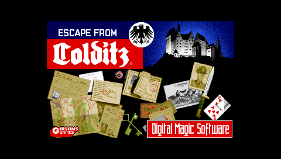
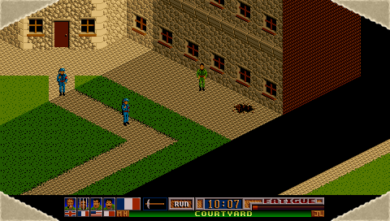
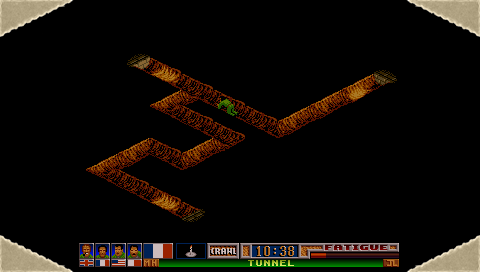
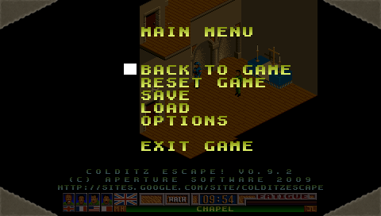

Home
====

General Information
-------------------

__Colditz Escape__ is a rewritten game engine for the classic _"Escape From Colditz"_ Amiga game.
In this game, you control a set of four prisoners of war trying to escape from the infamous Colditz Castle WWII prison.

The original game, created by __Mike Halsall__ and __John Law__ (with intro music by [__Bjørn Lynne__](http://www.lynnemusic.com/)), was published in 1991 by Digital Magic Software.
This new version, which allows you to play the game on the PSP and Windows platforms, has been reverse engineered from the original Amiga game engine and is released under a GPL v3 license.

Please note that the latest version comes with all the data files required for the game - just extract the archive and play ;)

Screenshots
-----------

 
 

Installation
------------

 * Extract the zip content into the relevant directory (`PSP/GAME/` on PSP, any location on Windows). It should create a "Colditz" directory there
 * Launch the game (`colditz.exe` on Windows).

Please see the FAQ for additional information.

Controls
--------

The Windows controls use the numeric keypad as virtual joystick, along with <kbd>5</kbd> for joystick fire (similar to UAE controls). Make sure that <kbd>Numlock</kbd> is on.
The controls can be modified by editing the `config.xml` file which is created when the game is first run. You can also use a joystick for directions on Windows

For the PSP, the direction is with the analog pad.

Please see the FAQ for additional information.

Downloads
---------

* [PSP Executable](http://colditzescape.googlecode.com/files/Colditz%20Escape%21%200.9.4%20-%20PSP.zip) (2.2 MB),  v0.9.4
* [Windows Executable](http://colditzescape.googlecode.com/files/Colditz%20Escape%21%200.9.4%20-%20WIN.zip) (2.4 MB), v.0.9.4
* [Sourcecode](https://github.com/aperture-software/colditz-escape/archive/v0.9.4.tar.gz), v0.9.4 (4.3 MB, also accessible through github)
* The original game's [Reverse Engineered disassembly](https://sites.google.com/site/colditzescape/goodies/ReverseEngineeringAnalysis.7z?attredirects=0) (if you are actually deranged enough to want to look at this stuff)

History
-------

* v0.9.4 [2010.07.06]: Fixed memory leaks + various updates.
* v0.9.3 [2009.11.23]: Minor bugfixes + new 2x GPU shader on Windows. Data files are now included in release.
* v0.9.2 [2009.08.17]: First public release!
